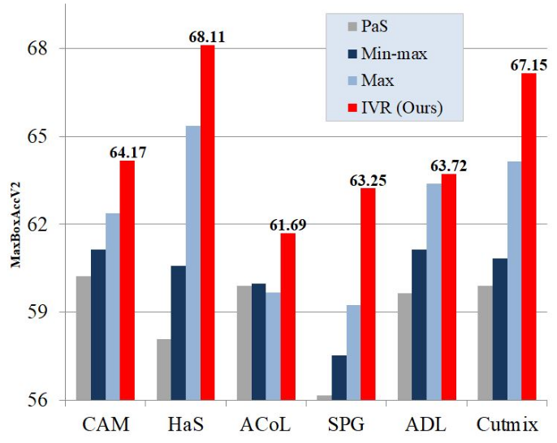
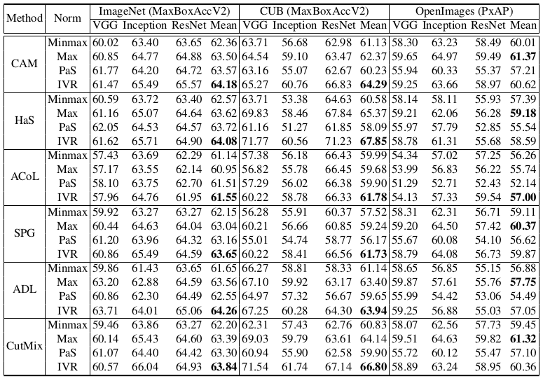

## Normalization Matters in Weakly Supervised Object Localization (ICCV 2021)

**99% of the code in this repository originates from this [link](https://github.com/clovaai/wsolevaluation).**


[ICCV 2021 paper](https://arxiv.org/abs/2107.13221)

Jeesoo Kim<sup>1</sup>, Junsuk Choe<sup>2</sup>, Sangdoo Yun<sup>3</sup>, 
Nojun Kwak<sup>1</sup>  


<sup>1</sup> <sub>Seoul National University</sub> 
<sup>2</sup> <sub>Sogang University</sub>
<sup>3</sup> <sub>Naver AI Lab</sub>

Weakly-supervised object localization (WSOL) enables finding an object using a dataset without any localization
information. By simply training a classification model using only image-level annotations, the feature map of the model
can be utilized as a score map for localization. In spite of many WSOL methods proposing novel strategies, there
has not been any de facto standard about how to normalize the class activation map (CAM). Consequently, many 
WSOL methods have failed to fully exploit their own capacity because of the misuse of a normalization method. In this
paper, we review many existing normalization methods and point out that they should be used according to the property
of the given dataset. Additionally, we propose a new normalization method which substantially enhances the performance of any CAM-based WSOL methods. Using the proposed normalization method, we provide a comprehensive
evaluation over three datasets (CUB, ImageNet and OpenImages) on three different architectures and observe significant performance gains over the conventional min-max normalization method in all the evaluated cases.

</img>

__Re-evaluated performance of several WSOL methods using different normalization methods.__ Comparison of several WSOL methods with different kinds of normalization 
methods for a class activation map. The accuracy has been evaluated under MaxBoxAccV2 with CUB-200-2011 dataset. 
All scores in this figure are the average scores of ResNet50, VGG16, and InceptionV3.
In all WSOL methods, the performance using our normalization method, IVR, is the best.

## Prerequisite

Dataset preparation, Code dependencies are available in the [original repository](https://github.com/clovaai/wsolevaluation).
[Evaluating Weakly Supervised Object Localization Methods Right (CVPR 2020)]
[(paper)](https://arxiv.org/abs/2001.07437)
\
This repository is highly dependent on this repo and we highly recommend users to refer the original one.

#### Licenses 

The licenses corresponding to the dataset are summarized as follows

Dataset    | Images                                   | Class Annotations | Localization Annotations
-----------|------------------------------------------|-------------------|----------------
ImageNetV2 | See the [original Github](https://github.com/modestyachts/ImageNetV2) |  See the [original Github](https://github.com/modestyachts/ImageNetV2)  | CC-BY-2.0 NaverCorp.
CUBV2      | Follows original image licenses. See [here](release/CUBV2_image_licenses.txt). | CC-BY-2.0 NaverCorp. | CC-BY-2.0 NaverCorp.
OpenImages | CC-BY-2.0 (Follows original image licenses. See [here](https://storage.googleapis.com/openimages/web/factsfigures.html)) | CC-BY-4.0 Google LLC | CC-BY-4.0 Google LLC

Detailed license files are summarized in the [release](release) directory.  

**Note**: At the time of collection, images were marked as being licensed under 
the following licenses:
```
Attribution-NonCommercial License
Attribution License
Public Domain Dedication (CC0)
Public Domain Mark
```
However, we make no representations or warranties regarding the license status 
of each image. You should verify the license for each image yourself.

## WSOL training and evaluation

We additionally support the following normalization methods:

* Normalization.
  - `Min-max`
  - `Max`
  - `PaS`
  - `IVR`
  
Below is an example command line for the train+eval script.
```bash
python main.py --dataset_name CUB \
               --architecture vgg16 \
               --wsol_method cam \
               --experiment_name CUB_vgg16_CAM \
               --pretrained TRUE \
               --num_val_sample_per_class 5 \
               --large_feature_map FALSE \
               --batch_size 32 \
               --epochs 50 \
               --lr 0.00001268269 \
               --lr_decay_frequency 15 \
               --weight_decay 5.00E-04 \
               --override_cache FALSE \
               --workers 4 \
               --box_v2_metric True \
               --iou_threshold_list 30 50 70 \
               --eval_checkpoint_type last
               --norm_method ivr
```

See [config.py](config.py) for the full descriptions of the arguments, especially 
the method-specific hyperparameters.

## Experimental results
Details about experiments are available in the paper.
\
</img>

## Code license

This project is distributed under MIT license.

```
Copyright (c) 2020-present NAVER Corp.
Permission is hereby granted, free of charge, to any person obtaining a copy
of this software and associated documentation files (the "Software"), to deal
in the Software without restriction, including without limitation the rights
to use, copy, modify, merge, publish, distribute, sublicense, and/or sell
copies of the Software, and to permit persons to whom the Software is
furnished to do so, subject to the following conditions:
The above copyright notice and this permission notice shall be included in all
copies or substantial portions of the Software.
THE SOFTWARE IS PROVIDED "AS IS", WITHOUT WARRANTY OF ANY KIND, EXPRESS OR
IMPLIED, INCLUDING BUT NOT LIMITED TO THE WARRANTIES OF MERCHANTABILITY,
FITNESS FOR A PARTICULAR PURPOSE AND NONINFRINGEMENT. IN NO EVENT SHALL THE
AUTHORS OR COPYRIGHT HOLDERS BE LIABLE FOR ANY CLAIM, DAMAGES OR OTHER
LIABILITY, WHETHER IN AN ACTION OF CONTRACT, TORT OR OTHERWISE, ARISING FROM,
OUT OF OR IN CONNECTION WITH THE SOFTWARE OR THE USE OR OTHER DEALINGS IN THE
SOFTWARE.
```

## 5. Citation

```
@article{kim2021normalization,
  title={Normalization Matters in Weakly Supervised Object Localization},
  author={Kim, Jeesoo and Choe, Junsuk and Yun, Sangdoo and Kwak, Nojun},
  journal={arXiv preprint arXiv:2107.13221},
  year={2021}
}
```
```
@inproceedings{choe2020cvpr,
  title={Evaluating Weakly Supervised Object Localization Methods Right},
  author={Choe, Junsuk and Oh, Seong Joon and Lee, Seungho and Chun, Sanghyuk and Akata, Zeynep and Shim, Hyunjung},
  year = {2020},
  booktitle = {Conference on Computer Vision and Pattern Recognition (CVPR)},
  note = {to appear},
  pubstate = {published},
  tppubtype = {inproceedings}
}
```
```
@article{wsol_eval_journal_submission,
  title={Evaluation for Weakly Supervised Object Localization: Protocol, Metrics, and Datasets},
  author={Choe, Junsuk and Oh, Seong Joon and Chun, Sanghyuk and Akata, Zeynep and Shim, Hyunjung},
  journal={arXiv preprint arXiv:2007.04178},
  year={2020}
}
```
